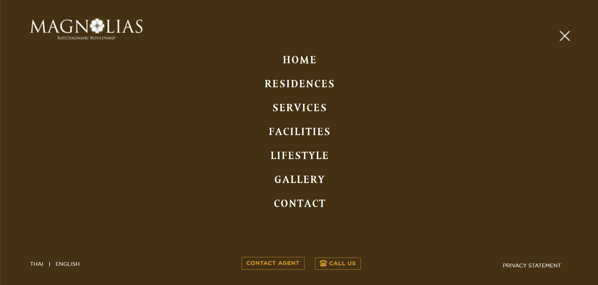
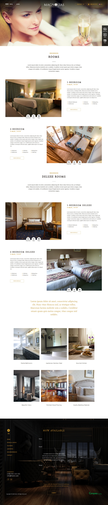

# Magnolias Ratchadamri Boulevard — Residential Property Management Website (Custom WordPress Theme)

A custom **WordPress Theme** converted from a static HTML website, built with **PHP, HTML5, CSS3, and JavaScript**.  
The project leverages **Advanced Custom Fields (ACF)** to transform static sections into **dynamic, editable content**, allowing clients to update text and images directly via the WordPress admin panel.  

---

  
    

---

## Features

- 🏠 **Custom WordPress Theme**: Converted from static HTML to a fully functional WordPress CMS.  
- 🖼 **Dynamic Content Management**: ACF integration enables clients to update text, images, and layouts without coding.  
- 🏘 **Residences Pages**: Templates for one-bedroom, two-bedroom, and executive residences.  
- 📸 **Gallery & Lifestyle Pages**: Editable photo galleries and lifestyle highlights.  
- 🌍 **Location & Facilities**: Dynamic content sections for property highlights and nearby amenities.  
- 📞 **Contact Page**: Editable inquiry form and contact details.  
- 📱 **Responsive Design**: Custom grid system with page-specific responsive stylesheets.  
- ⚡ **Modular PHP Templates**: `header.php`, `footer.php`, and `functions.php` for maintainability.  

---

## Tech Stack

- **WordPress** – CMS platform  
- **Advanced Custom Fields (ACF)** – Dynamic field management  
- **PHP** – Theme development and backend logic  
- **HTML5, CSS3, JavaScript (jQuery)** – Frontend and UI effects  
- **Custom Grid System** – Mobile-first responsive design  

---
